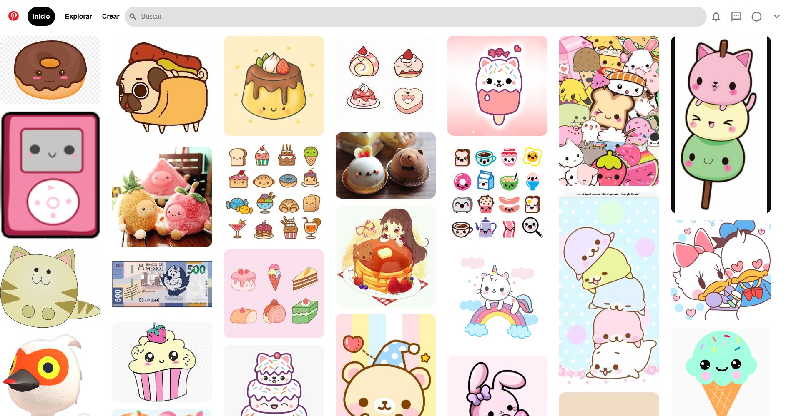

# Clon de Pinteres con HTML y css
Este proyecto es un clon de la interfaz de usuario de pinterest, creado puramente con HTML y CSS.

Se enfoca en replicar la apariencia visual de pinteres, ofreciendo una experiencia de navegación similar con un diseño responsive y funcionalidades básicas.

### Carácterísticas.

* **Diseño responsive:** Adaptable a diferentes tamaños de pantalla para una experiencia de usuario optima en dispositivos móviles.
* **Intefaz de usuario intuitiva:** Inspirada en pinterest con una navegación fácil y accesible.
* **Interacciones dinámicas:** Efectos visualespara elementos interactivos como botones y enlaces.
* **Iconografía y estilos modernos:** Uso de la biblioteca e iconos  de material desing y estilos CSS para una apariencia cool.👌
 
 ### Tecnologías utilizadas.
 + **HTML5:** Para la estructura básica del sitio.
 + **CSS3:** Para el diseño y el estilo, incluyendo _flexbox_ para un diseño responsivo y efectos de _hover_.
 + **Google Fonts:** para fuentes personalizadas.

### Vista previa del proyecto.

### Contacto
